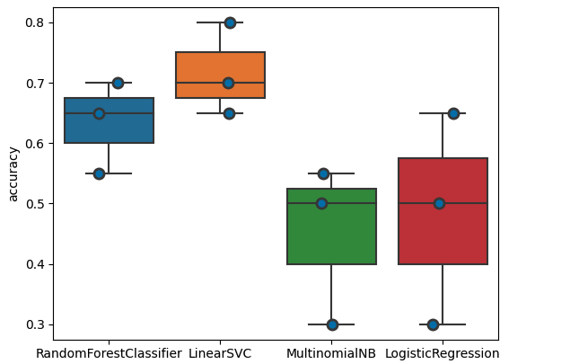
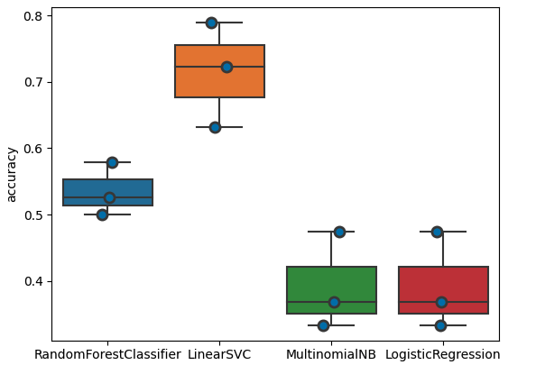
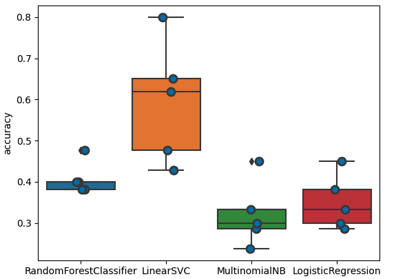
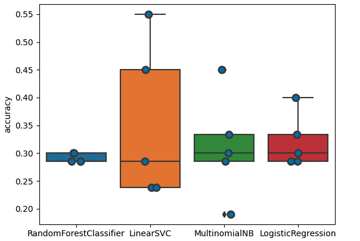

# stiaFinalProject

## Project Overview

The purpose of this project was to use specific 2023 Spring course offerings from Georgetown University to train various machine learning models to correctly predict the parts of the world that regionally focused classes are discussing, given only their course description.

The goal is to study how the model prejudices certain words or phrases as indicators of where in the world a course focuses on.

## BLUR: Bottom Line Up Front

* The larger the dataset, the worse the performance. That's good because it means the model can't find strong correlations between words and places

* If a couse description included 'violence' or 'coloni,' it would likely be classified as a class on Africa

* Majority class bias indicated that the majority of Georgetown classes studied the MENA region

## Problems and Solutions

Using machine learning for experiments requires three steps: collecting and creating the dataset, training machine learning methods, and measuring performance. For this, I used the Python programming language, Jupyter Notebook, and two Python libraries: NLTK for natural language processing and scikit-learn for access to machine learning tools.

### Access to Data

**Problem:** My first challenge was getting access to enough data. 

**Solution:** This involved manually going through each relevant class in MyAccess that pertained to my project and recording the course description and course title. 

**Takeaway:** Unfortunately, I wish I had access to more classes. As I added more classes to my dataset, I noticed my algorithms had lower error.

### Cleaning Data

**Problem:** My algorithms required creating uni and bi-grams to work. Destinctive and unique words were important, but filler words worsened accuracy.

**Solution:** I used libraries and online sources to help cut, stop, and stem words so that only unique, destinctive words were included in datasets. It also exacerbated differences between classes. Algorithms worked better when datasets were cleaned vs. when they were not

**Takeaway:** The majority of my time went in cleaning the dataset, not in the actual algorithm development

### No Free Lunch

**Problem:** Some algorithms returned high accuracy, and some did not. This made it difficult to extrapolate insights

**Solution:** With each dataset, I would use a variety of ML algorithms (LSV, Logistic Regression, Multinomal Naive Bayes, Random Forests). Extrapolated results incorporated results from all ML models together

**Takeaway:** Each algorithm has its own bias. Using various algorithms together provide better insights on the data

## Results -- Technical Details

Model accuracy over time:

Iteration 1: Original dataset of 56 classes without NLP
  

Iteration 2: Original dataset of 56 values with NLP

Iteration 3: Updated dataset of 103 values with NLP

Iteration 4: Updated dataset of 103 values after removing all "region identifying" language with NLP

## Results -- Project Conclusions

This experiment has demonstrated three main takeaways. 

First, data matters. How data gets collected, organized, and used has consequences for machine learning predictions. 

Second, accuracy is misleading; better accuracy doesn’t mean better results, especially with qualitative data. 

Third, biasing algorithms to look for bias works. 

These findings demonstrate the importance of machine learning in discussions about data collection and the proper use of technology. Under the status quo, only data informs the algorithm, not the other way around. By creating a mechanism through which the algorithm studies the data, we can more closely visualize how we choose to collect data.  

## Additional

My class [Final Paper](https://drive.google.com/file/d/1lz77F8ZhArWHcMAQ4kXrJqCWM0VPz_Xf/view?usp=sharing) provides a full report on the project. 